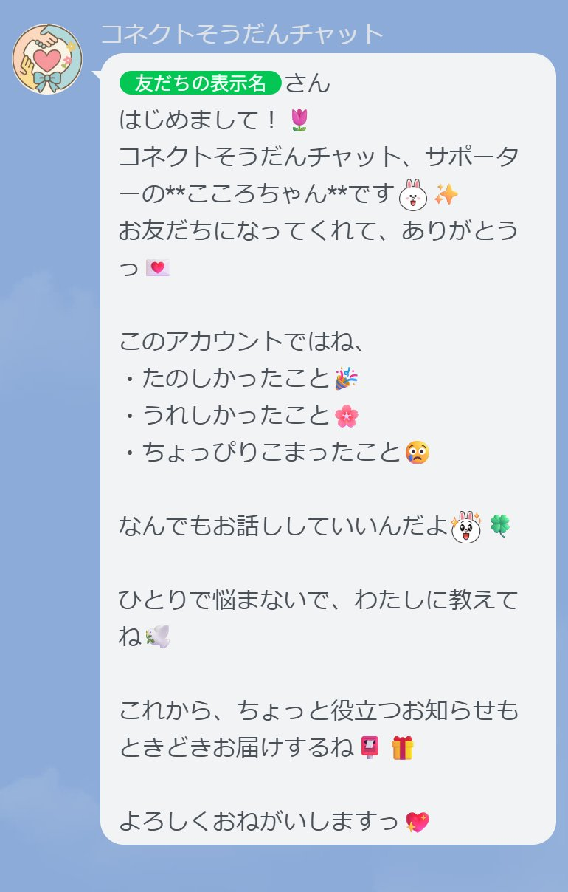

# コネクトそうだんチャット（こころちゃんBot）

このBotは、子どもや若者、高齢者の悩みを優しく受け止める**LINEチャットボット**です。  
可愛くて優しいキャラクター「こころちゃん」が、あなたの気持ちにそっと寄り添い、温かい言葉で返信します🌸✨

「こころちゃん」は、14歳の女の子。まるで親しい友人のように、安心して悩みを打ち明けられる存在です💖

---

## 🔧 技術構成
- Node.js（Express）
- LINE Messaging API
- Google Gemini API（Gemini 1.5 Flash / Gemini 1.5 Pro）
- Render または Replit でデプロイ

---

## 🛡️ ライセンス
このプロジェクトは **MITライセンス** のもとで公開されています。  
詳しくは `LICENSE` ファイルをご確認ください。

---

## 👤 開発者
特定非営利活動法人コネクト（法人申請中）  
**理事長・開発責任者：松本博文**  
📮 [https://connect-npo.org](https://connect-npo.org)

---

## 🚀 主な機能
- 🔍 **キーワード検出**：「いじめ」「つらい」「死にたい」などの危険ワードを検出し、適切な対応を促します
- 🤖 **AI応答**：「こころちゃん」があなたの気持ちに寄り添い、優しく返信します（現在1日10回まで）
- 🚨 **危険ワード通知**：緊急性の高いワード検知時、管理者LINEグループへ自動通知し迅速な対応を可能にします

---

## 📎 使用方法
1. LINEでBotを友だち追加してください
2. メッセージを送信すると、こころちゃんがやさしく返事してくれます💬

---

## 🌐 Webhook URL
本番環境:  
`https://chat.onrender.com/webhook`  
※LINE Developersのチャネル設定画面にて、上記URLをWebhookに登録してください。

---

## 💌 お問い合わせ
ご質問・ご相談は [connect-npo.org](https://connect-npo.org) サポートチームまでお気軽にご連絡ください。

---

## 📷 こころちゃんのLINE画面サンプル

以下は、LINEで友だち追加したときに表示される初回メッセージです🌸

